# Relay · Gateway Control Plane

Operations dashboard for the [`go-api-gateway`](../README.md) relay service.
Built with Next.js 16, TypeScript, Tailwind CSS 4, and shadcn/ui.

Portfolio piece demonstrating how to build a real-world SRE / platform
engineering dashboard that talks to a real Go backend.

## Screenshots

Each screenshot below shows a distinct part of the interface. Click any image
to view it full-size.

### 1. Overview

The landing page — live KPIs (RPS, p99 latency, error rate, circuit breaker
state) with sparklines, a traffic chart, the circuit breaker panel with
state-machine visualization, the middleware chain, the backend pool, and a
recent-requests table. Simulation control buttons at the top let you trigger
circuit breaker events in real time.

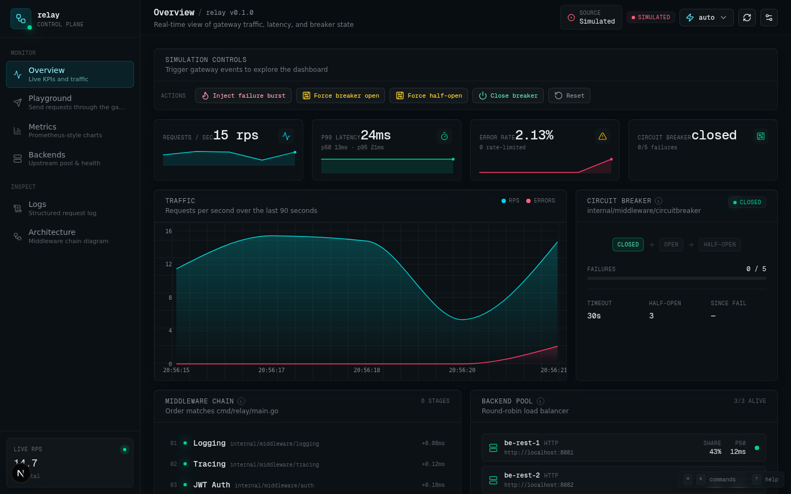

### 2. Playground — request builder

Send requests through the gateway with a configurable JWT. Preset buttons for
common paths, full header editor, body editor for non-GET methods. The JWT
token is auto-injected into the `Authorization` header.

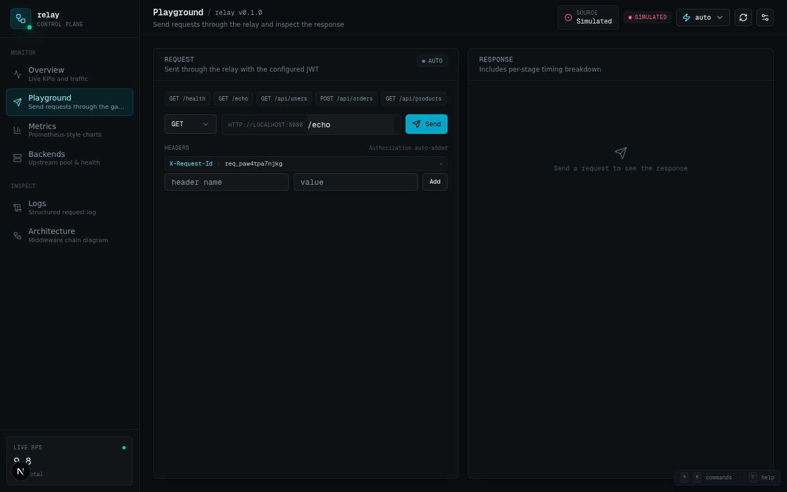

### 2b. Playground — response with timing waterfall

After sending a request, the response panel shows the status, total duration,
which backend handled it, and a per-stage timing waterfall — each middleware
stage (logging, tracing, auth, ratelimit, loadbalancer, circuitbreaker,
backend) is shown as a horizontal bar so you can see exactly where time is
spent.

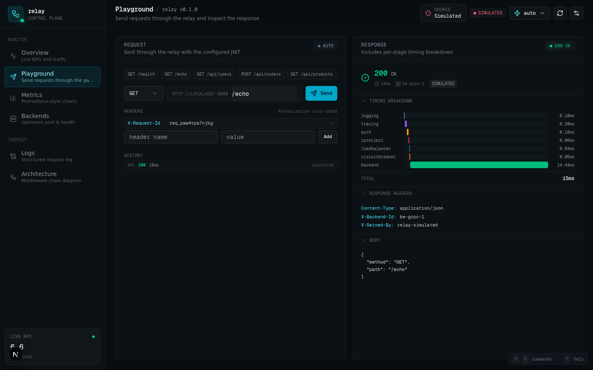

### 3. Metrics

Prometheus-style charts using Recharts: KPI cards for rps/p50/p95/p99/errors/
429s, latency trend (stacked p50/p95/p99 area chart), latency histogram
(bucketed distribution), status code distribution (horizontal bar), total
request counter, and the raw Prometheus text exposition when in live mode.

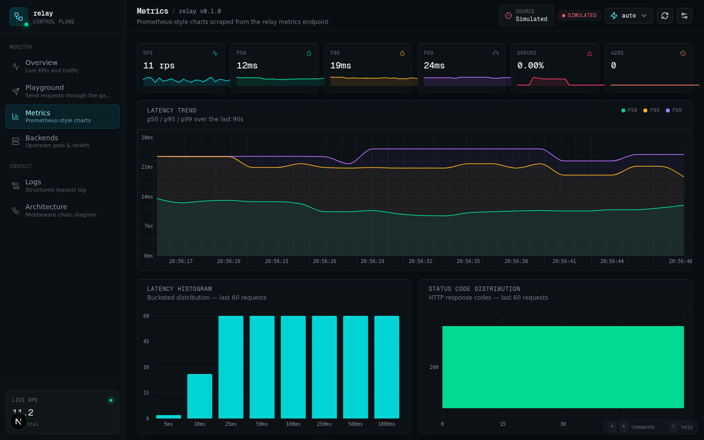

### 4. Backends

Upstream pool with per-backend cards: traffic share progress bar, average
latency, error rate, total requests handled, drain/enable controls. Pool
summary at the top shows total size, alive count, average latency, and pool
error rate.

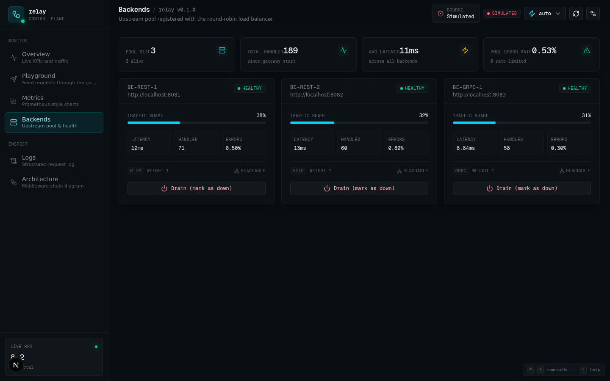

### 5. Logs

Structured `slog` viewer — newest first, with level filter (debug/info/warn/
error), free-text search across message and fields, pause/resume to freeze
the stream for inspection, and JSON export for offline analysis.

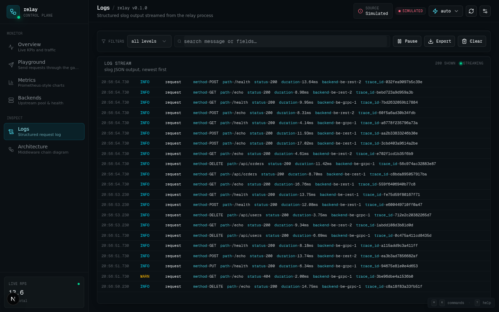

### 6. Architecture

Visual flow diagram of the middleware chain. Left column shows the inbound
request path (client → each middleware → backend), right column shows the
outbound response path. Detail cards below explain each stage with its package
path and overhead.

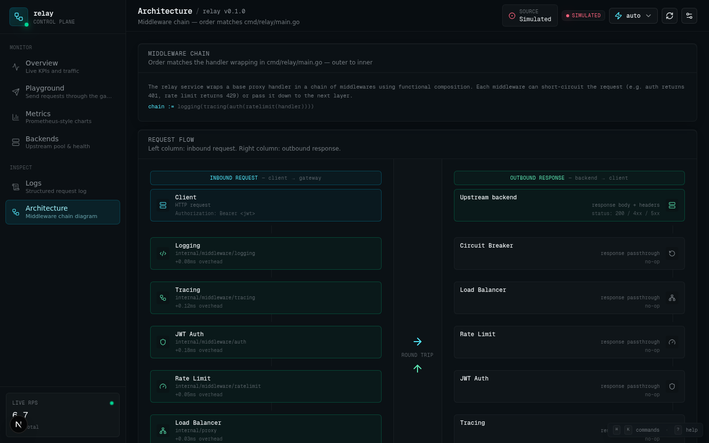

### 7. Command palette (⌘K)

Press `⌘K` (or `Ctrl+K`) anywhere to open the command palette. Fuzzy-search
across all views and actions — navigate with arrow keys, run with Enter.

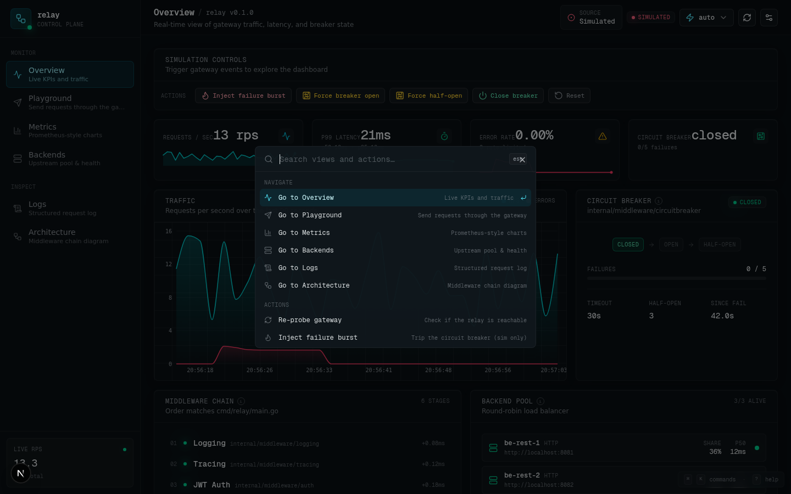

### 8. Keyboard cheat sheet (?)

Press `?` to bring up the full list of keyboard shortcuts. Numbers 1–6 switch
between views, `R` re-probes the gateway, `Esc` closes any open dialog.

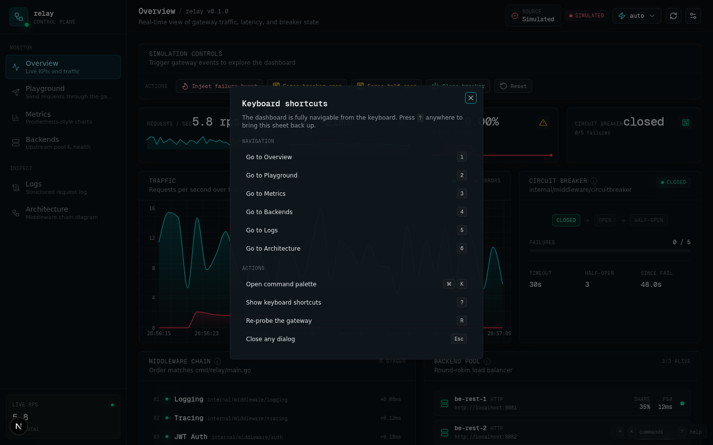

### 9. Concept explainer

Small `i` buttons next to circuit breaker, rate limit, JWT, load balancing,
tracing, and middleware chain titles open a written explanation of the
pattern — the problem it solves, how it works, how it's implemented in this
gateway, and what else is worth knowing.

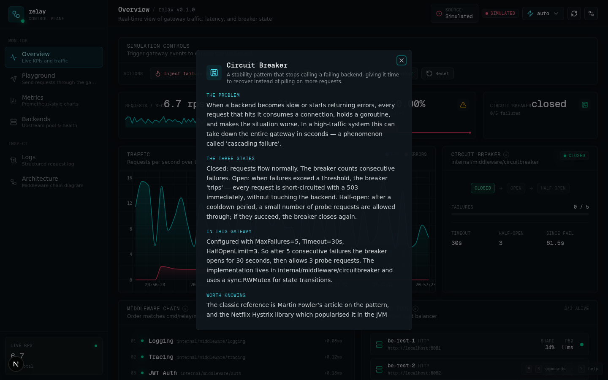

### 10. Onboarding tour

First-time visitors get a 6-step walkthrough with progress dots. Skipped or
completed tours are remembered via `localStorage` so they don't pester
returning users.

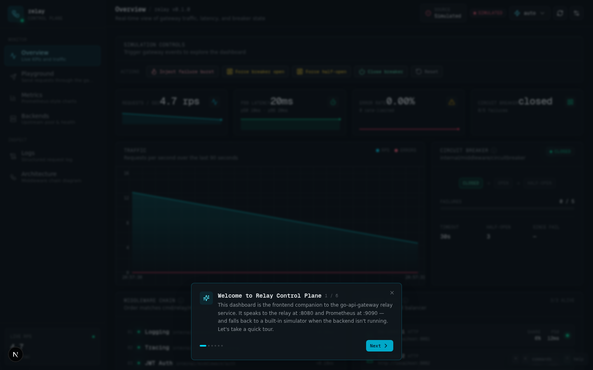

### 11. Circuit breaker — open state

Clicking "Force breaker open" (or "Inject failure burst") trips the circuit
breaker. The state badge turns rose, the visualization shows `open` as the
active state, and subsequent requests return 503 with "service unavailable —
circuit open" log entries.

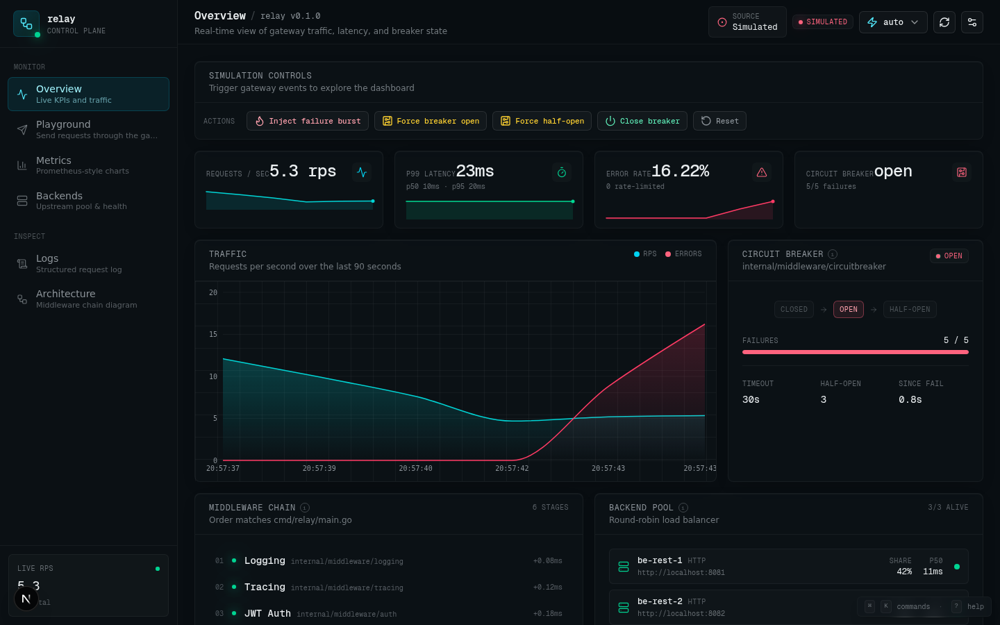

## Quick start

```bash
cd web
bun install
bun run dev      # http://localhost:3000
bun run lint     # ESLint
bun test         # 61 unit tests across 3 files
```

No backend required — the dashboard ships with a built-in simulator that
reproduces the behavior of the Go relay (token bucket, circuit breaker,
round-robin). Switch to `live` mode in the top bar to talk to a real relay.

## Features

### Six views

| View          | What's there                                                       |
| ------------- | ------------------------------------------------------------------ |
| **Overview**  | KPI cards with sparklines, live traffic chart, circuit breaker panel with state machine visualization, middleware chain, backend pool, recent requests table, simulation control buttons |
| **Playground**| Request builder (method, path, headers, body, presets) with JWT auto-injected. Response panel shows status, per-stage timing waterfall, response headers, and body |
| **Metrics**   | Prometheus-style charts using Recharts: latency trend (p50/p95/p99), latency histogram, status code distribution, total request counter, plus raw Prometheus exposition in live mode |
| **Backends**  | Pool stats + per-backend cards with traffic share, latency, error rate, drain/enable controls |
| **Logs**      | Structured `slog` viewer with level filter, free-text search, pause/resume, JSON export |
| **Architecture** | Visual flow diagram of the middleware chain (request → backends → response) plus detail cards for each stage |

### Interview-friendly extras

- **Built-in simulation engine** (`src/lib/gateway/mock-engine.ts`) —
  reproduces the Go middleware's token bucket, circuit breaker state
  machine, and round-robin balancer in TypeScript. See [ADR-0003](./docs/adr/0003-simulation-engine.md).
- **Concept explainer modals** — click the `i` dots next to circuit breaker,
  rate limit, JWT, load balancing, tracing, or middleware chain to open a
  written explanation of the pattern.
- **Keyboard shortcuts** — `1`–`6` to switch views, `⌘K` for the command
  palette, `?` for the cheat sheet, `R` to re-probe.
- **Command palette** (⌘K) — fuzzy-searchable list of every view and action.
- **Onboarding tour** — first-run walkthrough with progress dots, stored in
  localStorage.
- **Unit tests** (61 tests, 3 files) — pin down the formatters, the circuit
  breaker state machine, and the contract with the Go backend. Run with
  `bun test`.
- **Architecture Decision Records** (`docs/adr/`) — five short documents
  explaining *why* each major choice was made.
- **TypeScript types mirror Go structs** — `DEFAULT_GATEWAY_CONFIG` matches
  the constants in `cmd/relay/main.go`, and a test enforces it. See
  [ADR-0005](./docs/adr/0005-types-mirror-go-structs.md).

### Live mode

When a real relay is reachable, the dashboard switches to live mode:

- Playground requests go through `fetch()` to the relay at `:8080` with
  the configured JWT
- The Metrics view scrapes and parses the Prometheus text exposition from
  `:9090/metrics`
- The connection badge in the top bar shows probe latency

Switch via the **Settings** gear in the top bar, or press `⌘K` and search
for "live".

## Architecture

```
web/
├── docs/adr/                # Architecture Decision Records
├── screenshots/             # Screenshots for the README
├── public/
├── src/
│   ├── app/
│   │   ├── layout.tsx       # Forces dark theme, sets metadata
│   │   ├── page.tsx         # Entry — renders <DashboardShell />
│   │   └── globals.css      # Dark SRE theme tokens, scrollbars, glow utilities
│   ├── lib/gateway/
│   │   ├── types.ts         # Domain types matching Go structs (ADR-0005)
│   │   ├── client.ts        # Live fetch wrapper + Prometheus parser
│   │   ├── mock-engine.ts   # Simulated gateway (ADR-0003)
│   │   ├── store.ts         # Zustand store (ADR-0002)
│   │   ├── format.ts        # Display formatters
│   │   ├── use-keyboard-shortcuts.ts
│   │   └── __tests__/       # Unit tests (bun test)
│   ├── components/
│   │   ├── shell/           # Sidebar, topbar, dashboard shell, command palette, cheat sheet, onboarding
│   │   ├── overview/        # KPIs, traffic chart, CB panel, backend pool
│   │   ├── playground/      # Request builder, response panel, timing waterfall
│   │   ├── metrics/         # Recharts visualizations
│   │   ├── backends/        # Backend cards with controls
│   │   ├── logs/            # Structured log viewer with filters
│   │   ├── architecture/    # Middleware chain flow diagram
│   │   ├── common/          # Panel, StatusDot, Sparkline, ConceptExplainer
│   │   └── ui/              # shadcn/ui primitives
│   └── hooks/
└── package.json
```

## Tech stack

- **Next.js 16** with App Router — single-route SPA (see [ADR-0001](./docs/adr/0001-single-route-spa.md))
- **TypeScript 5** strict mode throughout
- **Tailwind CSS 4** with custom dark SRE theme tokens
- **shadcn/ui** for primitive components (Button, Dialog, Select, etc.)
- **Recharts** for time-series and histogram visualizations
- **Zustand** for global state — single store, selector-based subscriptions
- **Lucide** for iconography
- **Bun** as the test runner and package manager

## Design language

Terminal-inspired dark theme. See [ADR-0004](./docs/adr/0004-dark-theme-default.md).

- **Background**: deep slate (`oklch(0.16 0.012 240)`) with a subtle 24px dot grid
- **Primary accent**: cyan (`oklch(0.78 0.15 195)`) — represents "active request"
- **Healthy**: emerald — alive backends, `closed` breaker state
- **Degraded**: amber — `half-open` breaker, rate-limited responses
- **Errors**: rose — `open` breaker, 5xx responses, failure logs
- **Typography**: Geist Sans for body, Geist Mono for numeric/code; `tabular-nums` globally

## Documentation

- [Screenshots](./screenshots/) — 12 annotated screenshots covering every view and feature
- [ADRs (Architecture Decision Records)](./docs/adr/README.md) — five documents explaining the major design choices
- [Main project README](../README.md) — describes the Go backend

## License

Same as the parent repository.
